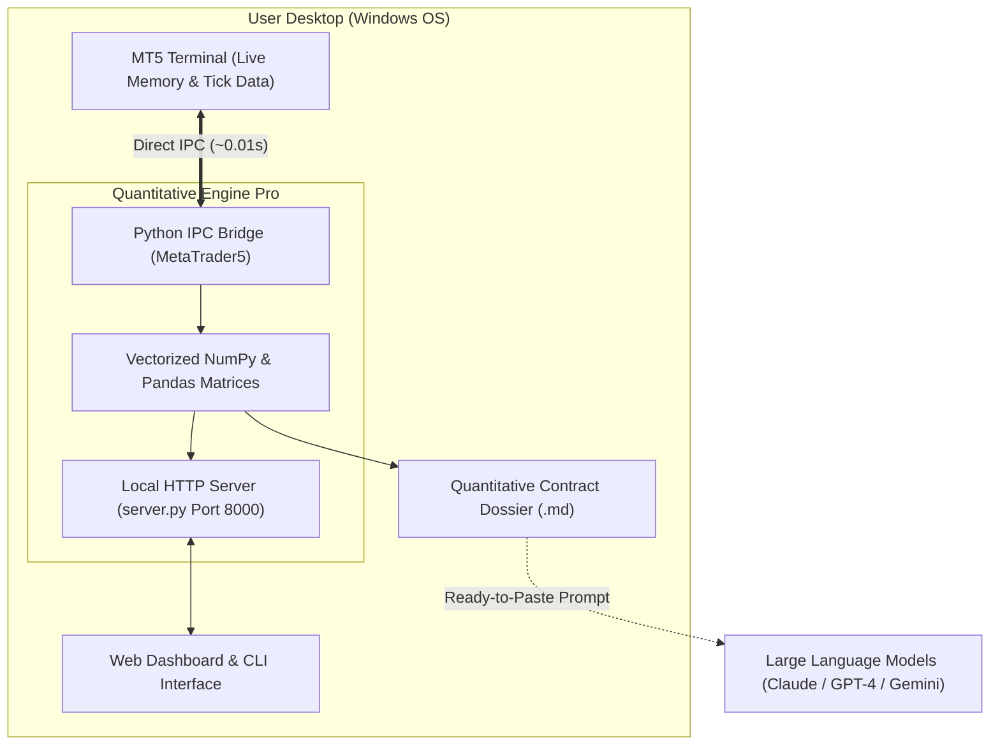

# 📈 MT5 Direct-Terminal Quantitative Analyzer Pro

[](https://opensource.org/licenses/MIT)
[](https://www.python.org/downloads/)
[](https://www.microsoft.com/en-us/windows/)
[]()

An ultra-low latency (**~0.01s**) quantitative trading engine and real-time dashboard designed for **MetaTrader 5 (MT5)** on Windows. 

Unlike traditional trading bots that require complex broker REST API registrations, OAuth tokens, or webhooks, this tool uses **Direct Inter-Process Communication (IPC)** to read live tick data and market structures straight from the active MT5 terminal memory running on your desktop.

## 🏗️ Architecture & Workflow



---

## ⚡ Key Selling Points

* **Zero API Configuration**: No API keys, secret tokens, or complex broker setup required. Just launch your desktop MT5 terminal, open your broker account (Live or Demo), and start analyzing.
* **Blazing Fast (< 0.01s Latency)**: Powered by *pure vectorized NumPy and Pandas* calculations combined with an in-memory TTL caching layer for multi-timeframe matrices.
* **Institutional AI Dossier Generator**: Automatically synthesizes a structured Markdown quantitative contract (.md) formatted specifically for Large Language Models (LLMs / Claude / GPT-4) to diagnose market regimes and calculate exact risk-to-reward parameters.
* **100% Privacy Preserving**: Built-in sanitization automatically masks personal broker login IDs before exporting or saving reports.

---

## 🧠 Core Technical Features

1. **Static Support & Resistance Engine**:
   * **Daily Pivot Points (Standard)**: Automatically computes `PP`, `R1-R3`, and `S1-S3` based on the previous closed daily candle (D1).
   * **H4 Structural Liquidity Swings**: Evaluates the highest highs and lowest lows across the last 30 H4 bars.
2. **Vectorized Candlestick Pattern Recognition**:
   * Instantaneous mathematical detection of key reversal patterns on the latest 15m timeframe: **Pin Bars** (Hammers/Shooting Stars), **Bullish/Bearish Engulfing**, and **Dojis**.
3. **Multi-Timeframe (MTF) Trend Confluence**:
   * Synchronous extraction of broad macro trend directions across **H1**, **H4**, and **D1** timeframes compared against key exponential moving averages (**EMA20/50**).
4. **Live Market Environment Audit**:
   * Real-time broker **Spread** calculation and **Trading Session Identification** (Sydney, Tokyo, London, New York, and session overlaps) mapped from broker server UTC timestamps.

---

## 🚀 Quickstart Guide

### Prerequisites
1. **Windows OS** (Required for official `MetaTrader5` Python IPC integration).
2. **MetaTrader 5 Desktop Client** installed and logged into any broker (e.g., Exness, FTMO, IC Markets).
3. **Python 3.9 or higher**.

### Installation

1. Clone this repository:
   ```bash
   git clone https://github.com/YOUR_GITHUB_USERNAME/mt5-terminal-analyzer.git
   cd mt5-terminal-analyzer
   ```

2. Install the lightweight dependencies:
   ```bash
   pip install -r requirements.txt
   ```

---

## 💻 Usage

### Option A: One-Click Web Dashboard (Recommended)
Simply double-click the included Windows Batch file:
```text
START_MT5_DASHBOARD.bat
```
* Or run via terminal:
  ```bash
  python server.py
  ```
* Open your browser to `http://localhost:8000` to interact with the live Expo Design System dashboard.

### Option B: Command Line Interface (CLI)
Analyze any symbol directly in your terminal:
```bash
python trading_analyzer_mt5.py XAUUSDm 15m
```

---

## 🛡️ Privacy & Security Guarantee

This project is built with developer privacy as a first principle:
* **No Cloud Telemetry**: All data remains local between your MT5 terminal and your local `server.py` instance.
* **Auto-Masking**: Account numbers are masked (e.g., `MT5 User (46XXXX74)`) in generated prompt outputs.
* **Git Safe**: The `.gitignore` file strictly blocks local credential files (`.env`, `.oanda_config`), scratch files, and generated `reports/` directories from ever being pushed to public repositories.

---

## 📄 License

This project is licensed under the **MIT License** — see the [LICENSE](LICENSE) file for details. Free for commercial, personal, and educational use.
